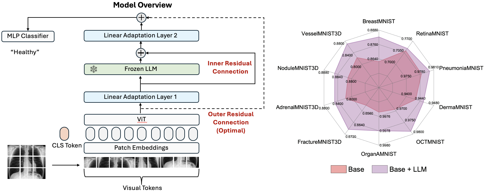
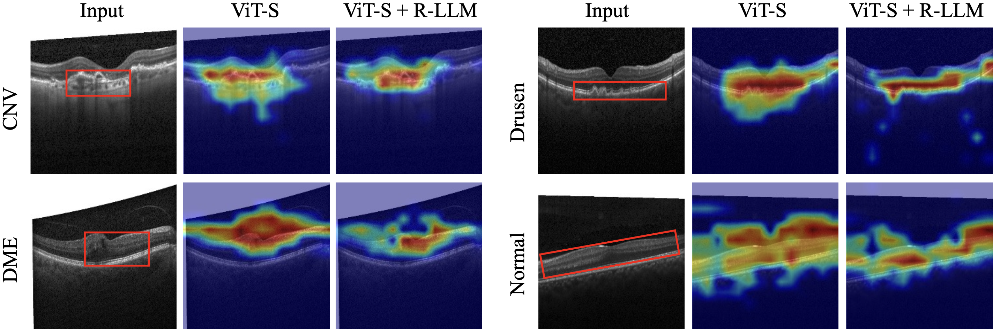

# SubTab: 
##### Author: 

[Language Models are Free Boosters for Biomedical Imaging Tasks](https://arxiv.org/abs/2403.17343)
Zhixin Lai, Jing Wu, Suiyao Chen, Yucheng Zhou, Naira Hovakimyan

# Table of Contents:

1. [Introduction](#introduction)
2. [Model](#model)
3. [Repo Structure](#Repo-Structure)
4. [Environment](#environment)
5. [Data](#data)
6. [Training and Evaluation](#training-and-evaluation)
7. [Model Zoo](#model-zoo)
6. [Adding New Datasets](#adding-new-datasets)
7. [Results](#results)
8. [Heatmap](#Heatmap)
9. [Citing the paper](#citing-the-paper)
10. [Citing this repo](#citing-this-repo)

# Introduction
In this study, we uncover the unexpected efficacy of residual-based large language models (LLMs) as part of encoders for biomedical imaging tasks, a domain traditionally devoid of language or textual data. The approach diverges from established methodologies by utilizing a frozen transformer block, extracted from pre-trained LLMs, as an innovative encoder layer for the direct processing of visual tokens. This strategy represents a significant departure from the standard multi-modal vision-language frameworks, which typically hinge on language-driven prompts and inputs. We found that these LLMs could boost performance across a spectrum of biomedical imaging applications, including both 2D and 3D visual classification tasks, serving as plug-and-play boosters. More interesting, as a byproduct, we found the proposed framework achieved superior performance, setting new state-of-the-art results on extensive, standardized datasets in MedMNIST-2D and 3D. Through this work, we aim to open new avenues for employing LLMs in biomedical imaging and enriching the understanding of their potential in this specialized domain.

# Model



# Repo Structure

<pre>
- 2D_classification
    |-datasets
    |-models
    |-output
    |-llama
    |-main.py
    |-main-cam.py
    
- 3D_classification
    |-datasets
    |-models
    |-output
    |-llama
    |-main.py
    ...
</pre>

# Environment
We used Python 3.8 for our experiments. The environment can be set up by following three steps:

```
pip install -r requirements.txt
```

# Data
For 2D Medical MNIST image classification, you can run the cmd below to download the dataset first. 
For your own dataset, follow the instructions in [Adding New Datasets](#adding-new-datasets).
```
cd 2D_classification
craete dataset: python ./datasets/data_load.py --data_flag {dataset name, like octmnist}
```
For 3D Medical MNIST classification, the dataset preparation is integrated together with training and evaluation, so you don't need to create dataset beforehand.

# Training and Evaluation
For 2D image model training and evaluation, use the cmd line below. You can choose vit-small model vit_small_patch16_224 or vit_llama_small_patch16_224
When you train the models with `llama`, please add an argument `--llama_path` pointing to the directory of your LLaMA-7B checkpoints. The contents in the directory should contains things like: `checklist.chk`, `consolidated.00.pth`, and `params.json`.

```
Training: 
CUDA_VISIBLE_DEVICES=4 python -m torch.distributed.launch --nproc_per_node=1 --master_port=29504 main.py --exp_name retinamnist_vit --model vit_small_patch16_224 --data-path ./datasets/retinamnist --num_workers 8 --batch-size 128 --epochs 400 --resume ./checkpoint/vit-small/checkpoint.pth
CUDA_VISIBLE_DEVICES=5 python -m torch.distributed.launch --nproc_per_node=1 --master_port=29505 main.py --exp_name retinamnist_new_llm_res1 --model vit_res_in_llama_small_patch16_224 --data-path ./datasets/retinamnist --num_workers 8 --batch-size 128 --epochs 400 --resume ./checkpoint/vit-llama-small/checkpoint.pth --llama_path ./llama/pyllama_data/7B

Inference: 
CUDA_VISIBLE_DEVICES=1 python main.py --model vit_small_patch16_224 --data-path ./datasets/retinamnist --eval --resume ./output/vit_small_patch16_224/retinamnist_vit/best_model_acc.pth
CUDA_VISIBLE_DEVICES=1 python main.py --model vit_res_in_llama_small_patch16_224 --data-path ./datasets/retinamnist --eval --resume ./output/vit_res_in_llama_small_patch16_224/retinamnist_new_llm_res1/best_model_acc.pth --llama_path ./llama/pyllama_data/7B
```

For 3D image model training and evaluation, use the cmd line below. Can choose models 
(vivit, vivit_small, vivit_large; vivit_llm, vivit_llm_small, vivit_llm_large; vit, vit_small, vit_large; vit_llm, vit_llm_small, vit_llm_large) 
, different llm mode (llm_mlp, llm_in, llm_out, llm_hybrid), and unfreeze llm via llm_grad (true)
When you train the models with `llama`, please add an argument `--llama_path` pointing to the directory of your LLaMA-7B checkpoints. The contents in the directory should contains things like: `checklist.chk`, `consolidated.00.pth`, and `params.json`.

```
Training: 
python ./main.py --dataset fracturemnist3d --model vivit --cuda 4
python ./main.py --dataset fracturemnist3d --model vivit_llm --llm_mode llm_mlp --cuda 4
python ./main.py --dataset fracturemnist3d --model vivit_llm --llm_mode llm_in --cuda 4
python ./main.py --dataset fracturemnist3d --model vivit_llm --llm_mode llm_in --llm_grad true --cuda 4
python ./main.py --dataset fracturemnist3d --model vivit_llm --llm_mode llm_out --cuda 4
python ./main.py --dataset fracturemnist3d --model vivit_llm --llm_mode llm_hybrid --cuda 4

Inference: 
python ./main.py --mode test --dataset fracturemnist3d --model vivit --checkpoint ./output/vivit/fracturemnist3d/best_acc_checkpoint.pth --cuda 4
python ./main.py --mode test --dataset fracturemnist3d --model vivit_llm --llm_mode llm_mlp --checkpoint ./output/vivit_llm/llm_mlp/fracturemnist3d/best_acc_checkpoint.pth --cuda 4
python ./main.py --mode test --dataset fracturemnist3d --model vivit_llm --llm_mode llm_in --checkpoint ./output/vivit_llm/llm_in/fracturemnist3d/best_acc_checkpoint.pth --cuda 4
python ./main.py --mode test --dataset fracturemnist3d --model vivit_llm --llm_mode llm_in --checkpoint ./output/vivit_llm/llm_in/require_grad/fracturemnist3d/best_acc_checkpoint.pth --cuda 4
python ./main.py --mode test --dataset fracturemnist3d --model vivit_llm --llm_mode llm_out --checkpoint ./output/vivit_llm/llm_out/fracturemnist3d/best_acc_checkpoint.pth --cuda 4
python ./main.py --mode test --dataset fracturemnist3d --model vivit_llm --llm_mode llm_hybrid --checkpoint ./output/vivit_llm/llm_hybrid/fracturemnist3d/best_acc_checkpoint.pth --cuda 4
```

# Model Zoo
(To update)

# Adding New Datasets

To add a new 2D image dataset, you can use the following steps:

1. Put the new dataset under the ./2D_classification/datasets
2. The new dataset follows the structure 
<pre>
- dataset_name
    |-train
            |-label1
            |-label2
    |-val
            |-label1
            |-label2
    |-test
            |-label1
            |-label2
</pre>

# Results

Results at the end of training is saved under ```./output``` directory. Results directory structure is as following:

<pre>
- 2D_classification
    |-output
        |-model name
                |-experiment name
                    |-best_acc.pth
                    |-best_auc.pth
                    |-log.txt
- 3D_classification
    |-output
        |-model name
                |-dataset name
                    |-best_acc.pth
                    |-best_auc.pth
                    |-log.txt
</pre>

# Heatmap
We get the heatmap of ViT-S and ViT-S with R-LLM. 
  
You can get the heatmap of each layer of 2D image classification models. First, go to ./2D_classification and prepare the dataset under ./datasets. Second, update the layer in the func evaluate_cam pf engine.py. Then, run the cmd line below and the heatmap will be generated under ./dataset/CamSample

```
python main-cam.py --model vit_small_patch16_224 --data-path ./datasets/OCTMNIST_Origin/ --eval --resume ./2d_output/vit_small_patch16_224/OCTMNIST_Origin_new_vit_v1/best_model_acc.pth --llama_path ./llama/pyllama_data/7B
python main-cam.py --model vit_res_in_llama_small_patch16_224 --data-path ./datasets/OCTMNIST_Origin/ --eval --resume ./2d_output/vit_res_in_llama_small_patch16_224/OCTMNIST_Origin_new_llm_res1_v1/best_model_acc.pth --llama_path ./llama/pyllama_data/7B
```

# Citing the paper 
```
@misc{lai2024language,
      title={Language Models are Free Boosters for Biomedical Imaging Tasks}, 
      author={Zhixin Lai and Jing Wu and Suiyao Chen and Yucheng Zhou and Naira Hovakimyan},
      year={2024},
      eprint={2403.17343},
      archivePrefix={arXiv},
      primaryClass={cs.CV}
}
```

# Citing this repo 
If you use the repo in your studies and work, please cite it by using the following:

```
Zhixin Lai, Jing Wu, Suiyao Chen, Yucheng Zhou, Naira Hovakimyan. 2024. "LLMBoostMedical." GitHub. https://github.com/ZhixinLai/LLMBoostMedical/
```

# Acknowledgment
This project has been inspired by or directly incorporates components from the following projects:

- [LM4VisualEncoding](https://github.com/ziqipang/LM4VisualEncoding) alongside the paper [Frozen Transformers in Language Models are Effective Visual Encoder Layers](https://arxiv.org/abs/2310.12973) have been pivotal in shaping our approach. Drawing upon their insights, we adapted and expanded upon the image classification framework to accommodate 3D imaging data, experimenting with various configurations of residual blocks to enhance the model's performance on the medical image dataset.

Special thanks to the developers and contributors of the above projects for their valuable work. Your efforts have greatly assisted in the development of this project.

